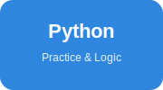
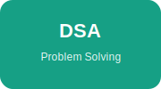
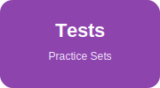
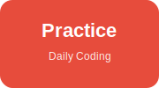

# DSA and Python Practice Repository

This repository is created for learning and practicing Python and Data Structures and Algorithms (DSA). It contains Python programs, practice questions, solved problems, notes, and test files that can help beginners, students, and aspiring developers improve their coding and problem-solving skills.

## What is inside this repository?

This repository includes:

- Python practice questions and solutions
- DSA practice programs and daily coding exercises
- Notes for important concepts and interview-related topics
- Test files for practice, revision, and self-evaluation
- Example programs for different topics and problem-solving patterns
- Structured folders to make learning easier and more organized

## Main folders

### 1. code
This folder contains most of the Python programs and practice questions, organized by topic.

- class_qustions_day_wise: daily DSA practice files from Day 1 to Day 15
- practice_questions: questions grouped by categories such as:
  - Data Type
  - Dictionary
  - Functions
  - Loops
  - OOPs
  - Operators
  - Recursion
  - Stack
  - Queue
  - Trees
  - Graphs
  - Linked List
  - Conditional statements
  - Lambda functions

### 2. notes
This folder contains markdown notes for learning Python and DSA concepts in a simple and beginner-friendly way.

### 3. Test1 and Test2
These folders contain practice test questions and section-wise exercises that can be used for revision and self-practice.

## Topics covered

This repository includes practice on:

- Python basics and syntax
- Variables and data types
- Conditional statements and decision-making
- Loops and iteration
- Functions and lambda expressions
- Error handling
- File handling
- Object-oriented programming
- Recursion
- Data structures such as stack, queue, linked list, tree, and graph
- Problem-solving techniques and logical thinking

## How to use this repository

1. Start with the notes folder to understand the concepts.
2. Open the Python files in the code folder and read the examples carefully.
3. Try to solve the questions on your own before looking at the solutions.
4. Practice the test files regularly to improve your confidence.
5. Repeat the topics until you feel comfortable with the logic and code.

## Learning benefits

By using this repository, you can:

- Improve your Python programming skills
- Strengthen your understanding of DSA concepts
- Practice problem-solving step by step
- Build confidence for interviews and exams
- Learn by doing with real coding examples

## Purpose of this repository

The main goal of this repository is to provide a simple, structured, and practical way to learn Python and DSA. It is useful for students, beginners, and anyone who wants to improve coding, logic building, and problem-solving skills.

This repository is a learning resource and can be used for regular practice, revision, and self-study.